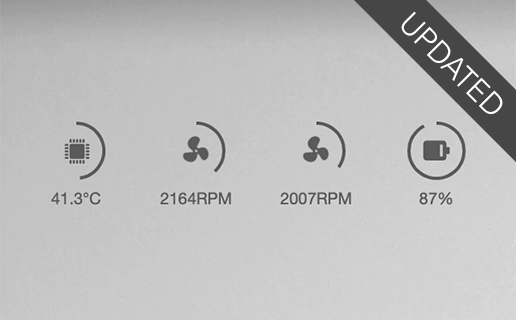

# iStats Widget

[](https://circleci.com/gh/roele/istats.widget/tree/master)
[](https://codecov.io/gh/roele/istats.widget)
[](https://github.com/roele/istats.widget/blob/master/LICENSE)

Made for [Übersicht](http://tracesof.net/uebersicht/).

Uses the [iStats Ruby Gem](https://github.com/Chris911/iStats "iStats") to obtain SMC information about your system.



## Installation

### Prerequisites

The widget requires the installation of the `iStats` Ruby gem to work. Installation of the gem requires
XCode Command Line Tools installed. Follow the steps outlined below to install the gem.

1. Open the Terminal.app
2. Issue the command `xcode-select --install`
3. Issue the command `sudo gem install iStats`
4. Issue the command `$(which istats)` and check for the output.

### Widget installation
To install the widget, extract the `istats.widget.zip` in your Übersicht widget folder (also see Übersicht > Preferences).

The final result should look similar to following.

    .
    ..
    getting-started.coffee
    istats.widget
    übersicht-logo.png


### Widget configuration

Some basic configuration options can be found in the file `index.jsx` in the top section defined as constant `config`.


* `stats` `{String|Object}` - Array of stat keys in rendering order.  

    The key has the format `<section>.<key>` or `{key: '<section.key>', icon: '<icon.name>'}` where the later format can be used to override the default icons (for available icons and names see [WebHostingHub](http://www.webhostinghub.com/glyphs/)).  

    Example:
    ```js
    stats: [
        'cpu.cpu-temp',
        {
            key: 'extra.tcgc-peci-gpu-temp',
            icon: 'icon-gpu-graphicscard'
        },
        'fan.fan-0-speed'
    ]
    ```
    Keys for which no data is present will be ignored. Availability of keys depends on the underlying hardware and enablement in context of `istats`. Please see [istats usage](https://github.com/Chris911/iStats#usage) or use `istats --help` on how to enable additional keys.  

    Available sections/keys:  
    * `cpu` - CPU stats  
        * `cpu-temp` - CPU temperature

    * `fan` - Fan stats
        * `total-fans-in-system` - Number of fans
        * `fan-0-speed` - Fan speed, where `0` represents the fan (index) number starting with `0`

    * `battery` - Battery stats
        * `cycle-count` - Load cycle count
        * `current-charge` - Current battery charge
        * `maximum-charge` - Maximum battery charge

    * `extra` - Extra stats
        * `tcgc-peci-gpu-temp` - PECI GPU temperature
        * any other extra as written in the `istats` output (lowercase, spaces replaced by `-`)

* `tempUnit` `{String}` - CPU temperature unit, either `C` (Celsius) or `F` (Fahrenheit)

* `position` `{String}` - Screen corner position, either `top-left`, `top-right`, `bottom-left` or `bottom-right`

* `top` `{String}` - Top position in px (e.g. `100px`)

* `left` `{String}` - Left position in px (e.g. `100px`)

* `bottom` `{String}` - Bottom position in px (e.g. `100px`)

* `right` `{String}` - Right position in px (e.g. `100px`)

* `animations` `{Boolean}` - Icon animations flag, either `true` or `false`

* `width` `{Number}` - Stat donut chart width in px (e.g. `74`)

* `height` `{Number}` - Stat donut chart height in px (e.g. `40`)

* `radius` `{Number}` - Stats donut chart radius in px (e.g. `18`)

* `strokeWidth` `{Number}` - Stat donut chart stroke width in px (e.g. `2`)

* `color` `{String}` - Stat color (e.g. `#666`)

* `iconSize` `{String}` - Stat icon size (e.g. `1.0rem`)

* `iconLineHeight` `{String}` - Stat icon line height (e.g. `2.5rem`)

* `labelSize` `{String}` - Stat label font size (e.g. `0.625rem`)


### Troubleshooting

* **The widget does not work and/or shows nothing**
    * Verify the location of your istats binary by issuing `which istats` in your shell and adapt the `command` property in the `index.jsx` accordingly.
    * Open `Show Debug Console` to verify if there are errors shown in the `Console` tab. If so please report an issue to https://github.com/roele/istats.widget/issues with the error details.
* **An error is shown in place of the widget**
    * Please report an issue to https://github.com/roele/istats.widget/issues with the error, environment and hardware details.
    * Did you upgrade your macOS recently? Try re-installing the iStats Ruby gem as indicated in the prerequisites.


### Credits

Icons by [WebHostingHub](http://www.webhostinghub.com/glyphs/)
